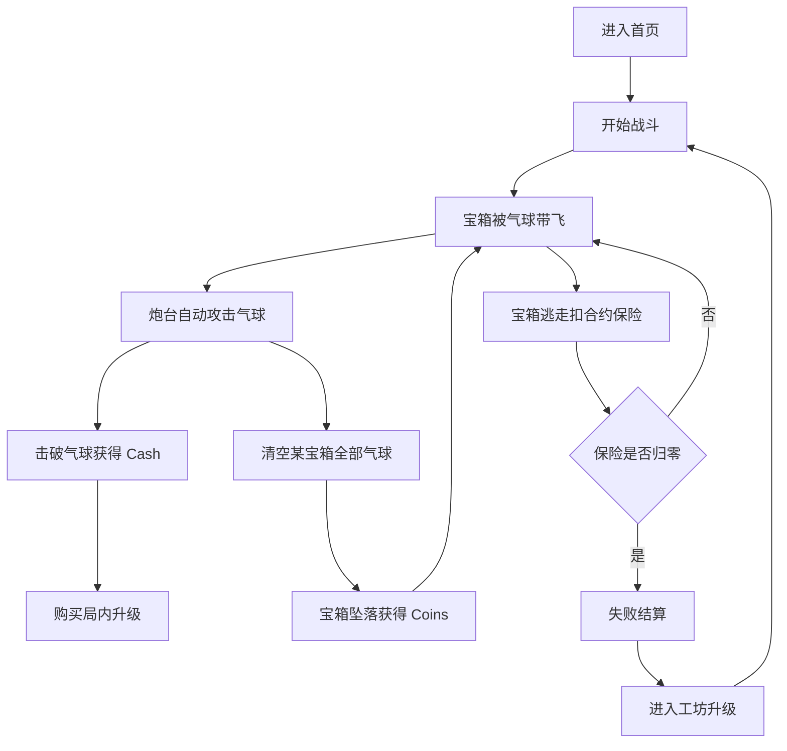

## 1. 产品概述
`Balloon Bounty` H5 MVP 是一款竖屏自动战斗放置游戏，核心体验是“拦截正在逃跑的财富”：玩家通过自动炮台打爆吊着宝箱的气球，让宝箱坠落并获得收益。
- 本版本目标是在 2~4 周内验证核心闭环是否成立，而不是一次性实现完整长线运营产品。
- 目标用户是喜欢放置、增量、轻策略和强反馈休闲游戏的移动端玩家。
- 核心验证指标是 `5 秒看懂玩法`、`15~25 秒首次爽点`、`首局失败后愿意再开`。

## 2. 核心功能

### 2.1 功能模块
1. **加载页**：资源加载、开始入口。
2. **首页**：开始游戏、工坊入口、设置入口、Coins 展示。
3. **战斗页**：自动攻击、宝箱上升、气球击破、保险扣减、局内升级。
4. **失败结算页**：战绩展示、获得 Coins、再来一局、前往工坊。
5. **工坊页**：永久成长升级。
6. **设置页**：音效、音乐、清档。

### 2.2 页面详情
| 页面名称 | 模块名称 | 功能说明 |
|-----------|-------------|---------------------|
| 加载页 | 加载进度 | 显示资源加载状态，加载完成后进入首页 |
| 首页 | 主要入口 | 提供开始游戏、工坊、设置入口，展示当前 Coins |
| 战斗页 | 宝箱战斗区 | 展示宝箱、气球、炮台、子弹、特效、逃逸线 |
| 战斗页 | 顶部信息栏 | 展示当前波次、合约保险、Cash |
| 战斗页 | 升级栏 | 提供 10 个局内升级按钮 |
| 战斗页 | 目标控制 | 提供优先级切换和点击集火能力 |
| 失败结算页 | 结算信息 | 展示波次、坠落数、漏箱数、Coins 收益 |
| 工坊页 | 永久升级 | 提供 6 个永久成长升级项 |
| 设置页 | 基础配置 | 音效开关、音乐开关、清档 |

## 3. 核心流程
- 用户进入首页后点击开始游戏，进入战斗页。
- 战斗中宝箱从屏幕下方进入，被气球吊起并持续向上移动。
- 炮台自动攻击气球，玩家使用 `Cash` 购买本局升级以提升输出、容错和经济。
- 当某个宝箱的所有气球都被打爆时，宝箱坠落并发放 `Coins`。
- 当宝箱越过逃逸线时，扣除 `合约保险`；保险归零则本局失败。
- 失败后进入结算页，玩家可查看收益并进入工坊永久强化，然后再次开局。

## 4. MVP 玩法设计

### 4.1 战斗规则
- 炮台固定在屏幕底部中央，自动锁定并攻击目标。
- 宝箱从屏幕下方生成并向顶部逃逸线移动。
- 只有同一宝箱上的所有气球都被打爆，宝箱才会坠落。
- 每打爆一颗气球获得 `Cash`，用于购买本局升级。
- 每成功救下一个宝箱获得 `Coins`，用于局外工坊升级。
- 宝箱越过顶部逃逸线即判定漏箱，按宝箱类型扣除保险。
- 合约保险为 0 时战斗结束。

### 4.2 内容范围
- 宝箱 5 种：小现金箱、普通宝箱、富人保险箱、黄金宝箱、UFO 大奖。
- 气球 5 种：普通气球、金气球、钢壳气球、加速气球、护盾气球。
- 目标优先级 2 种：快逃走优先、高价值优先。
- 点击集火：点击某个宝箱后，炮台优先攻击该目标 5 秒。
- 同屏最多 3 个宝箱，单宝箱气球数建议 2~8 个。

### 4.3 局内升级
| 分类 | 升级项 | 效果 |
|------|------|------|
| Attack | Damage | 提升单发伤害 |
| Attack | Fire Rate | 提升射速 |
| Attack | Range | 提升锁定范围 |
| Attack | Splash | 增加范围伤害 |
| Defense | Contract Insurance | 提升保险上限 |
| Defense | Claim Reduction | 降低漏箱扣保比例 |
| Defense | Slow Field | 降低宝箱上升速度 |
| Utility | Cash/Pop | 提升每颗气球 Cash 产出 |
| Utility | Coins/Drop | 提升宝箱坠落 Coins 奖励 |
| Utility | Interest | 定时给予额外 Cash |

### 4.4 局外成长
| 工坊升级项 | 效果 |
|------|------|
| 基础伤害 | 开局伤害提升 |
| 基础射速 | 开局射速提升 |
| 初始 Cash | 开局额外获得 Cash |
| Coins 收益 | 宝箱坠落 Coins 提升 |
| 保险上限 | 开局保险值上限提升 |
| 减速效果 | Slow Field 效果提升 |

## 5. 页面与交互要求

### 5.1 设计风格
- 风格关键词：轻卡通、夸张、明快、金币反馈强、适合短视频传播。
- 视觉核心：彩色气球、黄金宝箱、蓝天航线、强烈坠落反馈。
- 布局方向：移动端竖屏，信息集中在顶部和底部，战斗区居中。
- 交互重点：升级按钮易点，危险宝箱高亮，集火目标显著标记。

### 5.2 页面设计概览
| 页面名称 | 模块名称 | UI 要素 |
|-----------|-------------|-------------|
| 首页 | 主按钮区 | 大号开始游戏按钮、工坊按钮、设置按钮、Coins 展示 |
| 战斗页 | 顶栏 | 波次、保险条、Cash 展示 |
| 战斗页 | 战斗区 | 宝箱、气球、子弹、命中特效、逃逸线 |
| 战斗页 | 底部升级栏 | 10 个升级按钮、升级价格、可升级高亮 |
| 战斗页 | 右侧控制区 | 优先级切换按钮、当前策略标签 |
| 结算页 | 成绩卡片 | 波次、击破数、坠落数、漏箱数、Coins 收益 |
| 工坊页 | 升级列表 | 当前等级、效果说明、升级成本、升级按钮 |

### 5.3 响应式要求
- 以手机竖屏为主，基准设计尺寸为 `390 x 844`。
- 兼容常见 Android 高长屏和 iPhone 竖屏。
- 不要求桌面端完整适配，但桌面浏览器应可基本预览。
- 所有点击区域需满足触屏操作。

## 6. 新手引导
- 仅做轻引导，不使用多步遮罩教学。
- 首次出现宝箱时提示：`打爆所有气球，宝箱才会掉下来。`
- 首次漏箱时提示：`宝箱逃走会扣合约保险。`
- 首次可升级时提示：`用 Cash 升级火力和防逃能力。`

## 7. 数据与埋点
- 关键事件：进入首页、开始战斗、首次坠箱、首次升级、首次漏箱、战斗失败、进入工坊、完成工坊升级、再来一局。
- 关键参数：波次、战斗时长、当前保险值、本局 Coins、当前总 Coins。

## 8. 不做范围
- 不做卡牌、研究所、模组、Perks、无人机。
- 不做活动、公会、联赛、排行榜。
- 不做账号系统、云存档、防作弊。
- 不做正式广告和内购接入。
- 不做多主题皮肤和复杂运营入口。
