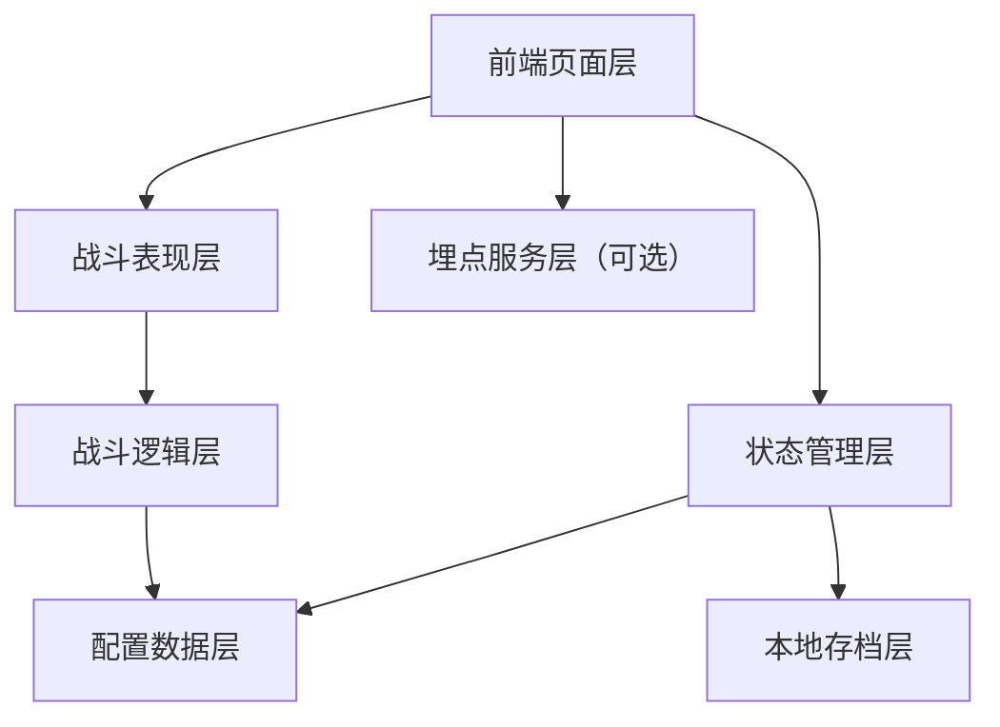
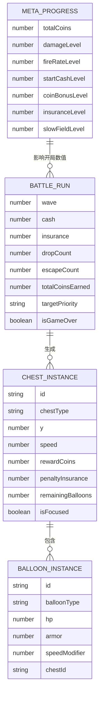

## 1. 架构设计



- 本版本采用纯前端 H5 架构，不依赖正式后端。
- 所有核心玩法、数值计算、升级和存档均运行在本地。
- 如需小规模测试，仅增加一个轻量埋点上报接口，不引入完整账号系统。

## 2. 技术说明
- 前端：React 18 + TypeScript + Vite
- 状态管理：Zustand
- 样式方案：Tailwind CSS
- 渲染方案：Canvas 2D 优先，必要时封装自定义渲染层
- 包管理：npm
- 测试：Vitest + React Testing Library
- 构建输出：静态前端资源

## 3. 路由定义
| 路由 | 用途 |
|-------|---------|
| / | 首页 |
| /battle | 战斗页 |
| /workshop | 工坊页 |
| /result | 失败结算页 |
| /settings | 设置页 |

## 4. 模块划分
| 模块 | 职责 |
|------|------|
| `src/pages` | 页面级容器，负责页面结构与导航 |
| `src/components` | 可复用 UI 组件和战斗展示组件 |
| `src/game` | 战斗核心逻辑、实体、波次、碰撞、掉落 |
| `src/store` | 全局状态管理，包括战斗状态和 Meta 进度 |
| `src/config` | 宝箱、气球、升级、波次等配置表 |
| `src/utils` | 数学、格式化、随机、对象池等工具 |
| `src/hooks` | 页面和系统复用逻辑 |
| `src/services` | 存档服务、埋点服务 |

## 5. 核心数据模型

### 5.1 数据模型定义



### 5.2 类型定义

```ts
export type TargetPriority = 'escape' | 'value'

export interface MetaProgress {
  totalCoins: number
  damageLevel: number
  fireRateLevel: number
  startCashLevel: number
  coinBonusLevel: number
  insuranceLevel: number
  slowFieldLevel: number
}

export interface BattleRunState {
  wave: number
  cash: number
  insurance: number
  dropCount: number
  escapeCount: number
  totalCoinsEarned: number
  targetPriority: TargetPriority
  isGameOver: boolean
}

export interface ChestConfig {
  id: string
  name: string
  rewardCoins: number
  penaltyInsurance: number
  baseSpeed: number
  balloonCount: number
  weight: number
}

export interface BalloonConfig {
  id: string
  name: string
  hp: number
  armor: number
  speedModifier: number
  rewardCash: number
}
```

## 6. 配置表设计
| 配置文件 | 说明 |
|------|------|
| `src/config/chests.ts` | 宝箱类型、奖励、罚值、速度、权重 |
| `src/config/balloons.ts` | 气球生命、护甲、Cash 产出、特殊效果 |
| `src/config/runtime-upgrades.ts` | 局内升级价格、成长公式、效果值 |
| `src/config/meta-upgrades.ts` | 工坊升级价格、等级上限、效果值 |
| `src/config/waves.ts` | 前 15 波手工配置及后续递增规则 |
| `src/config/tutorial.ts` | 轻引导触发条件与文案 |

## 7. 战斗逻辑方案
- 使用统一游戏循环驱动：`update(deltaTime)` + `render()`
- 战斗流程包含：生成宝箱、更新位置、炮台选目标、发射子弹、结算伤害、处理气球死亡、处理宝箱坠落或逃走、推进波次。
- 目标选择规则优先支持：
  - `escape`：选择最接近逃逸线的宝箱
  - `value`：选择奖励价值最高的宝箱
- 点击集火通过页面层向战斗逻辑发送 `focusTarget(chestId)` 指令，持续 5 秒。
- 子弹、命中特效、掉落粒子使用对象池，避免频繁创建销毁。

## 8. 状态管理方案
- `metaStore`：局外成长、本地 Coins、设置项、存档加载。
- `battleStore`：当前局战斗状态、升级选择、结算数据。
- `uiStore`：页面状态、Toast、引导状态。
- 战斗内高频数值更新由游戏引擎内部管理，必要数据再同步到 Zustand，避免过度渲染。

## 9. 存档方案
- 本地存档键名建议：`balloon-h5-mvp-save`
- 保存内容包含：
  - 工坊升级等级
  - 当前总 Coins
  - 设置项
  - 已触发的新手引导标记
- 存档时机：
  - 工坊升级完成后
  - 战斗结算后
  - 设置变更后

## 10. 埋点方案
- 采用前端封装埋点服务，默认支持本地日志和可选远程上报。
- 埋点事件包括：
  - `enter_home`
  - `start_battle`
  - `first_chest_drop`
  - `first_upgrade_click`
  - `first_escape`
  - `battle_fail`
  - `go_to_workshop`
  - `upgrade_meta`
  - `restart_battle`

## 11. 测试策略
- 单元测试：
  - 升级价格与效果计算
  - 保险扣减逻辑
  - 目标选择逻辑
  - 宝箱坠落与漏箱判定
- 组件测试：
  - 战斗 HUD
  - 升级按钮状态
  - 工坊升级面板
- 手动验证：
  - 首局 15~25 秒首次坠箱
  - 首局 8~12 分钟失败
  - 失败后成长感可感知
  - 中低端机基本流畅

## 12. 目录建议
```text
.trae/documents/
src/
  components/
  config/
  game/
  hooks/
  pages/
  services/
  store/
  utils/
public/
```

## 13. 非目标说明
- 本版本不建设数据库。
- 本版本不提供账号系统、排行榜、联赛、公会。
- 本版本不接正式支付和广告。
- 本版本不实现完整后端 API。
